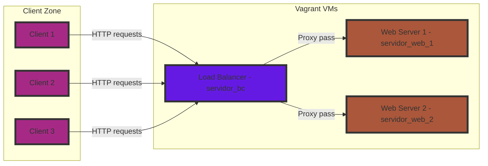
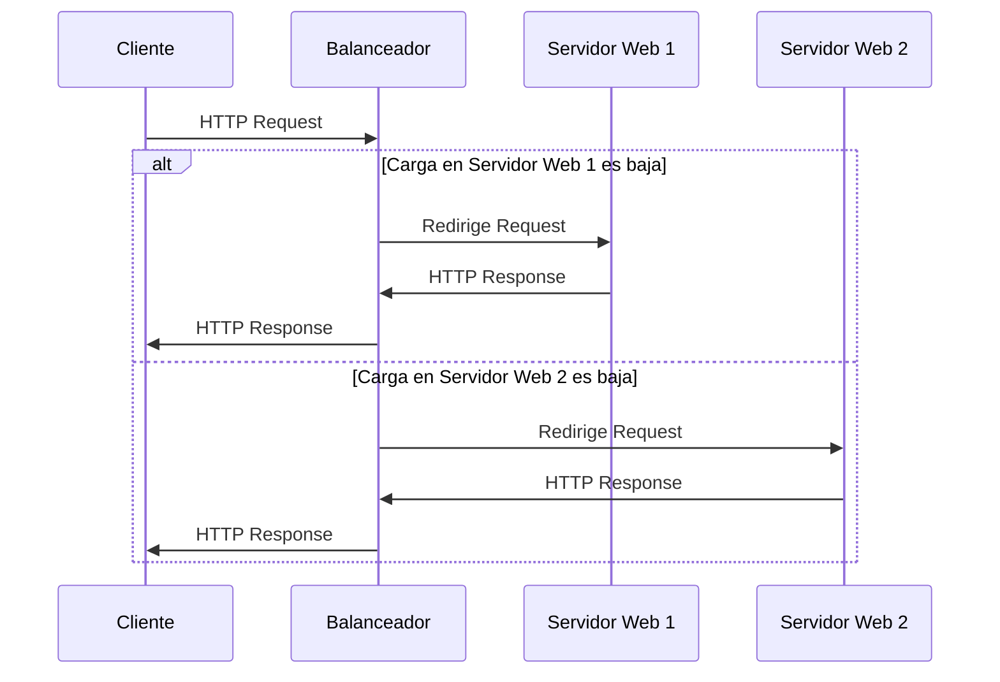

# Proyecto de Balanceador de Carga

## Descripción

Este proyecto implementa un balanceador de carga utilizando Nginx, destinado a distribuir el tráfico de entrada entre varios servidores web, aumentando la disponibilidad y la redundancia de nuestras aplicaciones web.

## Arquitectura propuesta

## Características

- **Alta disponibilidad**: Asegura que el sistema esté operativo el mayor tiempo posible.
- **Escalabilidad**: Permite añadir o quitar servidores sin interrumpir el servicio.
- **Flexibilidad**: Admite diferentes algoritmos de balanceo de carga.
- **Monitoreo**: Integra herramientas de monitoreo para observar el rendimiento del sistema.

## Requisitos Previos

Antes de comenzar, asegúrese de tener instalado lo siguiente:

- Vagrant
- VirtualBox o cualquier otro proveedor de VM compatible con Vagrant
- Herramientas de línea de comandos para su sistema operativo (bash, PowerShell)

## Diagrama de flujo

Este diagrama asume que el balanceador de carga seleccionará el servidor web basándose en el servidor con menos conexiones activas
